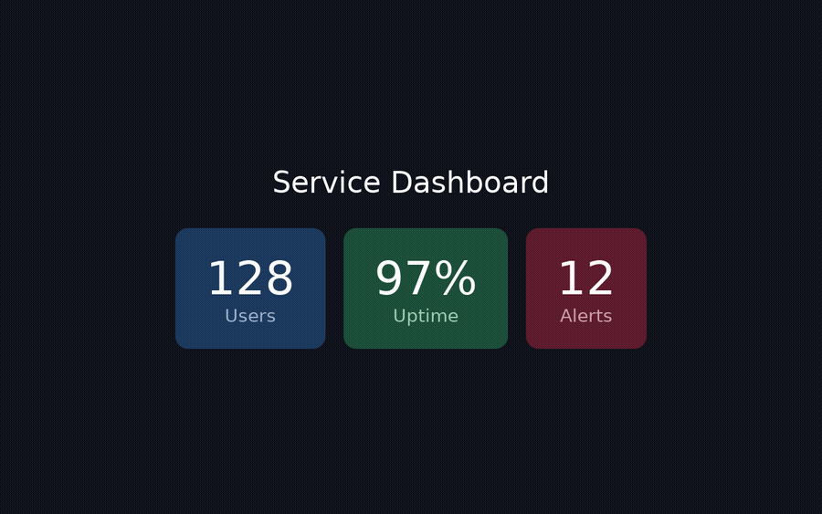

# dali-ui-preview-cli

> **DALi(Tizen) UI C++ 코드를 진짜 PNG 스크린샷 + 구조화된 JSON 씬 트리로 렌더링 — 코딩 에이전트(또는 당신)가 UI를 *눈으로 보고* 루프로 고칠 수 있게.**

[English](README.md) | **한국어**


<p align="center">
  
  <br><sub>작은 C++ 스니펫으로 CLI가 만든 4개의 실제 렌더 — 기기도 에뮬레이터도 없이. 각각 재현 가능한 <a href="samples/showcase">샘플</a>입니다.</sub>
</p>

## 무엇을 하나

DALi(Tizen의 동적 애니메이션 라이브러리)로 작성한 UI C++ 코드 조각을 Docker 컨테이너 안에서 헤드리스(headless, 화면 없이)로 렌더링한 뒤, 두 가지를 돌려줍니다: 실제 **PNG 스크린샷**과, 결정론적(deterministic, 같은 입력이면 항상 같은 출력)이고 기계가 읽을 수 있는 **UI 씬 트리**(각 노드의 id, 타입, 역할, 화면상 위치, 소스 줄 번호, 속성). 그런 다음 그 렌더 결과를 목표 이미지나 트리와 **대조(verify)**하고, 종료 코드(exit code)로 분기할 수 있습니다. `stdout`은 순수 JSON이라 에이전트의 파서에 그대로 넣을 수 있습니다.

## 왜

LLM 코딩 에이전트는 UI 코드를 작성할 수는 있지만, 그 결과가 제대로 보이는지 *볼* 수는 없습니다. `dali-ui-preview-cli`는 그 고리를 닫아줍니다. 에이전트는 **작성 → 렌더 → 비교 → 재작성** 루프를 돌리는데, 구조화된 트리(저렴하고 정확하며 diff 가능)를 먼저 읽고, 이미지(시각 확인용)를 그다음에 봅니다. 내 컴퓨터에 DALi SDK를 빌드할 필요가 없습니다 — Docker만 있으면 됩니다. 같은 루프는 터미널에서 레이아웃을 직접 눈으로 확인하는 사람에게도 똑같이 유용합니다.

## 사전 준비

- **Linux (x86-64) 전용.** 이 CLI는 Linux Docker 런타임 이미지(또는 네이티브 DALi 빌드 + `g++`/`Xvfb`)로
  실행을 넘기므로 **macOS·Windows 네이티브에서는 동작하지 않습니다** — 거기서 실행하면 즉시 종료코드 `14`와
  안내를 내고 멈춥니다. **Windows에서는 WSL2(Ubuntu)** 안에서 Docker를 갖춰 실행하세요(WSL2는 `linux`로
  보고되므로 아래 내용이 그대로 적용됩니다). macOS는 Linux VM이나 원격 Linux 호스트를 쓰세요. (어떤 호스트든
  `doctor`를 돌려보면 그 환경에서 되는지 확인됩니다.)
- **Node.js 18 LTS 권장** — CLI 자체 실행용. (18은 `engines`에 선언된 하한으로 *지원 LTS 정책*이지 기술적
  필수는 아닙니다. 코드는 ES2020 타깃이고 Node-18 전용 API를 쓰지 않아 14+ 구버전에서도 돌 가능성이 높지만
  공식 지원은 아님.) 또한 **git**이 필요합니다(GitHub-클론 설치가 repo를 클론·빌드하므로).
- **Docker**(기본 런타임) — 현재 사용자가 쓸 수 있어야 하며, 렌더 전 사전 점검에서 `docker info`를 실행합니다. 런타임 이미지는 **첫 렌더 시 자동으로 받아집니다** (약 290 MB; DALi Toolkit + 화면 없는 렌더링용 Xvfb 포함). **레지스트리는 자동 감지**됩니다 — 사내망에서는 BART GHCR 프록시 `ghcr-docker-remote.bart.sec.samsung.net/lwc0917/dali-preview-runtime`(간헐적 GHCR 끊김 회피), 그 외에는 `ghcr.io/lwc0917/dali-preview-runtime`(같은 repo path라 태그·다이제스트 동일). pull 시 **어느 서버에서 받는지 표시**됩니다. **`init` 없이도 첫 렌더나 `--pull` 때 자동으로 감지**됩니다 — 한 번 프로브해서 BART가 닿으면 BART를 쓰고 그 선택을 `.dali/config.json`에 저장하므로, 이후 렌더와 `doctor`는 재프로브 없이 재사용합니다. `--runtime-image` / `DALI_PREVIEW_IMAGE` 환경변수 / `.dali/config.json`의 `image` 키로 재정의할 수 있습니다.

> **VS Code 확장과 공유됩니다.** Docker 모드에서 이 CLI는 DALi Preview VS Code 확장과 *동일한* 런타임 이미지와 *동일한* 명명 볼륨(named volume, `dali-preview-ccache`, `dali-preview-shader-cache`)을 사용합니다. 이미 확장을 쓰고 있다면 이미지와 따뜻하게 데워진 빌드 캐시를 재사용하므로 — 추가 다운로드가 없고, 렌더가 더 빠르며, 이미지를 한 번만 갱신하면 두 도구 모두에 적용됩니다.

컨테이너는 Docker 렌더 경로에서만 필요합니다. `--version`, `--help`, `--list-versions`, 그리고 순수 트리/오버레이/diff 로직은 데몬이 살아 있지 않아도 됩니다.

## 런타임: Docker(기본) 또는 로컬

렌더 방식은 두 가지입니다. **Docker가 기본이며 별도 세팅이 필요 없습니다.** 렌더마다 고르거나, `init`으로 기본값을 저장할 수 있습니다.

| | Docker(기본) | 로컬(네이티브) |
|---|---|---|
| 필요 조건 | Docker 데몬 + 런타임 이미지 | 빌드된 DALi install + 호스트의 `g++`, `pkg-config`, `Xvfb` |
| 선택 | (기본) | `--runtime local` / `--local` |
| DALi 지정 | — | `--dali-prefix <경로>`, 또는 `DESKTOP_PREFIX` / `DALI_PREVIEW_PREFIX` 환경변수 |
| 결정성 | 고정 이미지, `llvmpipe` 소프트웨어 래스터 | *내* DALi 빌드 + 호스트 폰트/GPU에 의존(달라질 수 있음) |
| 이미지 관리 | `--list-versions` / `--pull` | 해당 없음(이미지 없음) |
| 실패 종료코드 | `12` Docker 사용 불가 | `13` 로컬 런타임 사용 불가 |

**로컬 모드**는 DALi 자체를 다시 빌드해서 방금 만든 `.so`가 프리뷰에 반영되길 원하는 uifw 개발자를 위한 것입니다. 사용법 두 가지:

```bash
# 일회성:
dali-ui-preview-cli app.preview.dali.cpp --runtime local --dali-prefix ~/dali-env/opt --image out.png

# 한 번 저장(.dali/config.json 기록)해두면 이후엔 플래그 없이 렌더:
dali-ui-preview-cli init            # Docker와 로컬을 모두 감지해 하나를 골라 저장
dali-ui-preview-cli app.preview.dali.cpp --image out.png
```

선택 우선순위(높은 것부터): `--runtime` / `--local` 플래그 → `DALI_PREVIEW_RUNTIME` 환경변수 → `.dali/config.json` → **docker** 기본. DALi prefix는 `--dali-prefix` → `DALI_PREVIEW_PREFIX` → `.dali/config.json` → `DESKTOP_PREFIX` → `setenv` 파일 → `pkg-config` → 공통 경로 순으로 해석합니다.

> **로컬 모드 주의사항.** 렌더가 고정 이미지가 아니라 *내* 호스트의 DALi 빌드·폰트·GPU를 쓰므로 Docker와 결과가 다를 수 있습니다(예: 한글/CJK는 `fonts-noto-cjk`가 설치돼 있어야 하며, 없으면 두부(□)로 나옵니다). 그래서 `--baseline` 시각 비교는 **런타임별로** 해야 합니다 — 비교할 런타임과 *같은* 런타임에서 baseline을 캡처·검증하세요. 씬 트리 구조는 두 런타임에서 동일합니다.

## 설치

이 CLI는 **GitHub repo에서 바로** 설치합니다 — 의도적으로 **npm에는 퍼블리시하지 않습니다.** 아래 명령은 모두
`dalihub/dali-ui-preview-cli`에서 설치/실행하며, `npm`/`npx`가 알아서 클론합니다. 컴파일된 JS가 **깃에 커밋돼 있어** 설치 시 **빌드 단계도, 빌드 도구(`tsc`/devDependencies)도 필요 없습니다** — 사내 npm이 devDependencies를 빼도(omit=dev) 설치됩니다(**Linux 전용**; Node 18 LTS 권장 + git — [사전 준비](#사전-준비) 참고).

**한 번 설치(권장)** — `dali-ui-preview-cli`를 PATH에 올려 렌더 루프를 빠르게(렌더마다 재클론 없음), 임시 파일도 안 쌓입니다:

```bash
npm i -g github:dalihub/dali-ui-preview-cli
dali-ui-preview-cli --version
```

**또는 npx로 즉석 실행(설치 없이)** — 원샷엔 충분하지만, npx는 콜드런마다 재클론+재빌드하므로 반복 렌더 루프엔
위의 전역 설치를 권장:

```bash
npx -y github:dalihub/dali-ui-preview-cli <input.cpp> --image out.png
```

**또는 소스에서:**

```bash
git clone https://github.com/dalihub/dali-ui-preview-cli
cd dali-ui-preview-cli
npm install
npm run compile
node out/cli.js <input.cpp>
# 선택: `dali-ui-preview-cli`를 PATH에 노출
npm link
```

아래 예시는 모두 `dali-ui-preview-cli`(전역 설치)를 사용합니다. 원샷은 `npx -y github:dalihub/dali-ui-preview-cli`로,
소스 체크아웃에서는 `node out/cli.js`로 바꾸세요.

## 환경 점검 (프리플라이트)

렌더하기 전에 에이전트는 **"런타임이 준비됐나?"**를 실패한 렌더로 알아내는 대신 먼저 물어야 합니다.
`doctor`가 그 답을 JSON 한 줄로 줍니다 — **네트워크 없음**(Docker 데몬 확인 + 로컬 이미지 태그 조회 +
파일시스템 확인만):

```bash
dali-ui-preview-cli doctor
```
```json
{"schemaVersion":1,"ready":true,"recommended":"docker","configured":null,
 "runtimes":{
   "docker":{"available":true,"imagePulled":true,"image":"ghcr.io/lwc0917/dali-preview-runtime:latest","issues":[]},
   "local":{"available":false,"prefix":null,"issues":["No DALi install found. Pass --dali-prefix <path>, set DESKTOP_PREFIX, or run `init`."]}}}
```

- `ready` — 지금 쓸 수 있는 런타임이 하나라도 있나. `recommended`(무플래그 렌더가 실제로 성공할 런타임 —
  저장된 `configured`가 쓸 수 있으면 그것, 아니면 Docker, 아니면 로컬)로 렌더하세요.
- 각 런타임의 **`issues`**는 사람에게 그대로 전달할 행동지시형 문자열입니다 — 고치려면 `sudo`가 필요하니
  에이전트는 조용히 실행하지 말고 **사람에게 전달**하세요.
- `docker.imagePulled:false`(단 `available:true`)여도 렌더는 됩니다 — 첫 렌더가 ~290MB 이미지를 한 번 받습니다.
- **준비되면 exit `0`, 쓸 수 있는 런타임이 없으면 `13`** — 그래서 `doctor && render`로 게이트할 수 있고,
  JSON 리포트는 **두 경우 다** stdout으로 나옵니다.

## 빠른 시작

프리뷰 파일을 렌더링하고 씬 트리를 출력합니다:

```bash
dali-ui-preview-cli samples/hello-dali.preview.dali.cpp
```

`stdout`은 한 줄짜리 JSON입니다(여기서는 보기 좋게 들여쓰고 일부를 줄였습니다):

```json
{
  "id": "0",
  "type": "Layer",
  "role": "panel",
  "name": "RootLayer",
  "mark": 1,
  "bounds": { "x": 0, "y": 0, "w": 1920, "h": 1080 },
  "children": [
    {
      "id": "0/1",
      "type": "FlexLayoutImpl",
      "role": "container",
      "mark": 3,
      "bounds": { "x": 0, "y": 0, "w": 1920, "h": 1080 },
      "sourceLine": 13,
      "flexProps": { "direction": "COLUMN", "alignItems": "CENTER", "justifyContent": "CENTER", "wrap": "NO_WRAP" },
      "children": [
        {
          "id": "0/1/0",
          "type": "LabelImpl",
          "role": "label",
          "text": "Hello, Dali!",
          "mark": 4,
          "bounds": { "x": 829, "y": 502, "w": 262, "h": 56 },
          "sourceLine": 21,
          "children": []
        },
        {
          "id": "0/1/1",
          "type": "LabelImpl",
          "role": "label",
          "text": "Edit this file to see the preview update",
          "mark": 5,
          "bounds": { "x": 787, "y": 558, "w": 346, "h": 20 },
          "sourceLine": 25,
          "children": []
        }
      ]
    }
  ],
  "meta": { "resolution": { "w": 1920, "h": 1080 }, "theme": "dark", "dpr": 1 }
}
```

(전체 트리에는 DALi가 끼워 넣는 넓이 0짜리 `CameraActor` 형제 노드 두 개도 포함됩니다. 라벨의 `name`은 비어 있고 — 화면에 보이는 글자는 `text`에 있습니다.)

스크린샷도 함께 저장:

```bash
dali-ui-preview-cli samples/hello-dali.preview.dali.cpp --image out.png
```

`--image`는 선택이며 stdout과 독립적입니다. PNG를 쓰지만 JSON은 바뀌지 않습니다.

## 입력 방식

프리뷰 코드는 세 가지 출처에서 올 수 있습니다(정확히 하나만 전달):

```bash
# 1. 파일 — *.preview.dali.cpp 파일, 또는
#    @dali-preview-begin / @dali-preview-end 마커로 영역을 표시한 일반 .cpp/.h 파일.
dali-ui-preview-cli samples/hello-dali.preview.dali.cpp

# 2. STDIN — `-` 위치 인자, 또는 그냥 파이프로 흘려보내기(위치 인자 없음).
cat samples/hello-dali.preview.dali.cpp | dali-ui-preview-cli
dali-ui-preview-cli - < samples/hello-dali.preview.dali.cpp

# 3. 인라인 — 명령줄에 직접 넘기는 코드 블록.
dali-ui-preview-cli --code 'return Label::New("Hello, Dali!");'
```

## 기능

아래 각 그룹은 라벨이 붙은 예시 하나씩입니다: 정확한 명령과 그 결과물. 대부분의 플래그는 조합 가능하며, 예외는 `--help`에 명시되어 있습니다.

### 주석이 달린 스크린샷 (Set-of-Mark) — `--overlay`

"Set-of-Mark"(요소마다 번호를 매겨 표시한) PNG를 씁니다. 각 노드에 트리의 `mark`와 일치하는 번호가 달린 자홍색 상자가 그려져서, 에이전트(또는 사람)가 컨트롤을 번호로 가리킬 수 있습니다.

```bash
dali-ui-preview-cli samples/hello-dali.preview.dali.cpp --overlay overlay.png
```

`#1 Layer`, `#3 FlexLayoutImpl`, `#4 "Hello, Dali!"`, `#5` 부제목 등으로 라벨이 붙은 상자가 그려진 `overlay.png`를 얻습니다. JSON 트리는 여전히 stdout으로 출력됩니다.

### 노드 찾기 — `--at` / `--node`

특정 픽셀에서 가장 위에 있는 노드 찾기:

```bash
dali-ui-preview-cli samples/hello-dali.preview.dali.cpp --at 500,290
```

```json
{ "id": "0/1/0", "mark": 4, "type": "LabelImpl", "role": "label", "bounds": { "x": 829, "y": 502, "w": 262, "h": 56 } }
```

또는 id로 노드의 영역 조회:

```bash
dali-ui-preview-cli samples/hello-dali.preview.dali.cpp --node 0/1/0
```

두 경우 모두 조회 JSON **만** 출력합니다(픽셀을 포함하는 가장 작은 상자가 우선). 둘은 함께 쓸 수 없습니다. 못 찾으면 `--at`은 `{ "at": [x,y], "node": null }`을, `--node`는 `null`을 출력합니다.

### 사람이 읽는 트리 — `--format tree`

```bash
dali-ui-preview-cli samples/hello-dali.preview.dali.cpp --format tree
```

```text
Layer "RootLayer" #1  [0]  (1920x1080 @ 0,0)
┠╴CameraActor "DefaultCamera" #2  [0/0]  (0x0 @ 960,540)
┠╴FlexLayoutImpl "" #3  [0/1]  (1920x1080 @ 0,0)
┃ ┠╴LabelImpl "" #4  [0/1/0]  (262x56 @ 829,502)
┃ ┖╴LabelImpl "" #5  [0/1/1]  (346x20 @ 787,558)
┖╴CameraActor "CaptureDefaultCamera" #6  [0/2]  (0x0 @ 960,540)
```

박스 트리 줄에는 액터의 `name`이 표시됩니다(라벨은 비어 있음). 화면에 보이는 글자는 JSON의 `text` 필드에 있습니다. `--format json`이 기본값입니다.

### 자체 완결 리포트 — `--report`

HTML 또는 Markdown 리포트(PNG 내장 + 박스 트리 + 노드 표)를 씁니다. JSON 트리는 여전히 stdout으로 출력되며, 파일 확장자가 형식을 결정합니다.

```bash
dali-ui-preview-cli samples/hello-dali.preview.dali.cpp --report report.html
dali-ui-preview-cli samples/hello-dali.preview.dali.cpp --report report.md
```

### 토큰 한도에 맞춰 출력 줄이기 — `--max-depth` / `--max-nodes`

stdout JSON을 에이전트의 컨텍스트 창에 맞게 잘라냅니다(`truncated` 표시로 잘린 지점을 알려줍니다):

```bash
dali-ui-preview-cli samples/hello-dali.preview.dali.cpp --max-depth 1
dali-ui-preview-cli samples/hello-dali.preview.dali.cpp --max-nodes 3
```

### 대조 루프 — `--baseline` / `--baseline-tree` / `--update-baseline`

에이전트 루프는 **작성 → 렌더 → 대조 → `$?`로 분기**입니다.

먼저, 정상이라고 확인된 렌더에서 기준선(baseline)을 잡습니다:

```bash
dali-ui-preview-cli good.cpp --update-baseline --baseline golden.png --baseline-tree golden.json
```

그런 다음 새 렌더를 기준선과 대조합니다. stdout은 한 줄짜리 판정(verdict)이 되고, 종료 코드는 **일치하면 0, 어긋나면 20**입니다(다른 코드는 여전히 도구 실패를 의미):

```bash
dali-ui-preview-cli candidate.cpp --baseline golden.png --baseline-tree golden.json
echo "exit: $?"
```

통과한 판정:

```json
{
  "match": true,
  "image": { "dimsMatch": true, "diffPixels": 0, "totalPixels": 614400, "ratio": 0, "pass": true },
  "tree": { "added": [], "removed": [], "changed": [] }
}
```

어긋난 판정(종료 코드 20) — 예: 어떤 노드의 위치가 움직인 경우:

```json
{
  "match": false,
  "image": { "dimsMatch": true, "diffPixels": 4673, "totalPixels": 614400, "ratio": 0.0076, "pass": false },
  "tree": { "added": [], "removed": [], "changed": [{ "id": "0/1/0", "fields": ["bounds"] }] }
}
```

한쪽 차원만 대조할 수도 있습니다(이미지만 보려면 `--baseline`, 트리만 보려면 `--baseline-tree`). `--threshold <ratio>`(기본값 `0.01`)는 이미지가 실패로 판정되기까지 허용되는 픽셀 차이 비율을 정하며, `--baseline`이 있어야 합니다.

### 렌더 설정 — `--resolution` / `--theme` / `--dpr`

```bash
dali-ui-preview-cli samples/hello-dali.preview.dali.cpp --resolution 800x480 --theme light --dpr 2
```

- `--resolution WxH` — 논리적 렌더 크기(기본값 `1920x1080`, TV FHD 프로파일).
- `--theme dark|light` — 배경 테마(기본값 `dark`).
- `--dpr N` — 장치 픽셀 비율(device-pixel ratio, 기본값 `1`); 실제 렌더는 `resolution × dpr` 장치 픽셀.

*실제 적용된* 논리 설정은 루트에 `root.meta = { resolution, theme, dpr }`로 반영됩니다.

### 실시간 재렌더 — `--watch`

입력 파일이 바뀔 때마다 다시 렌더링하고 다시 출력합니다(파일 입력에서만 — stdin이나 `--code`는 불가). 렌더당 한 번 출력하며, 중지는 Ctrl-C.

```bash
dali-ui-preview-cli samples/hello-dali.preview.dali.cpp --watch
```

### 이미지 애셋

`ImageView::New("assets/photo.jpg")` / `SetResourceUrl("…")`에 **프리뷰 파일 기준 상대경로**(또는 절대경로)를 주면 **양쪽 런타임 모두**에서 렌더됩니다 — CLI가 참조된 파일을 렌더로 복사하고 URL을 컨테이너 마운트(`/work/<name>`) 또는 호스트 경로로 재작성하므로 수동 마운트가 필요 없습니다. 못 찾거나 원격(`http(s)://`) URL은 ImageView 크기에 맞춰 번들된 **회색 broken-image placeholder**로 렌더돼 레이아웃이 유지됩니다 — 즉 회색 박스가 보이면 경로가 안 잡힌 것입니다. 이미지가 없는 프리뷰는 영향받지 않습니다(하네스 바이트 동일).

## 런타임 버전 (DALi 릴리스)

렌더는 `lwc0917/dali-preview-runtime`를 기준으로 실행됩니다 — 사내망에서는 **BART GHCR 프록시**(`ghcr-docker-remote.bart.sec.samsung.net`), 그 외에는 **GHCR**(`ghcr.io`)에서 받으며, 레지스트리는 자동 감지되고 pull 시 어느 쪽을 썼는지 알려줍니다. 이 이미지의 태그는 **DALi 릴리스**를 따라갑니다: 릴리스마다 `dali_<버전>` 태그 하나(예: `dali_2.5.26`)와, 굴러가는 `latest` 하나. **`latest`는 현재 DALi `2.5.26`을 가리킵니다**(아래 API 노트가 가정하는 dali-ui 버전); 어떤 버전이 있고 지금 무엇을 쓰는지는 `--list-versions`가 권위 있는 실시간 출처입니다(태그 목록은 항상 ghcr.io에서 읽으므로 프록시에서도 전체 목록이 보입니다). 첫 렌더는 태그를 자동으로 받으며, 아래 명령들은 어떤 태그를 보유하고 사용할지를 관리합니다. 이미지와 캐시가 **VS Code 확장과 공유**되므로, 런타임을 한 번만 갱신하면 두 도구 모두에 적용됩니다.

사용 가능한 버전(원격 레지스트리 ∪ 로컬 저장소)을 JSON으로 나열 — 렌더하지 **않으며**, 종료 코드 0:

```bash
dali-ui-preview-cli --list-versions
```

```json
{
  "image": "ghcr.io/lwc0917/dali-preview-runtime",
  "current": "latest",
  "versions": [
    { "tag": "latest", "local": true, "current": true },
    { "tag": "dali_2.5.26", "local": true, "current": false },
    { "tag": "dali_2.5.24", "local": false, "current": false }
  ]
}
```

특정 태그를 미리 받아두기(기본값 `latest`); docker의 진행 상황은 stderr로 흐르고, 그다음 `{"pulled":"<ref>","ok":true}` 한 줄이 stdout으로:

```bash
dali-ui-preview-cli --pull                  # :latest 받기
dali-ui-preview-cli --pull dali_2.5.26      # 특정 DALi 릴리스 받기
```

**런타임 업데이트.** 태그는 한 번 받으면 **캐시**됩니다 — 렌더는 로컬 이미지를 재사용하고 다시 받지 **않습니다**(빠르고, 재현 가능). 따라서 새 런타임이 배포돼도(`latest`가 옮겨졌거나 새 `dali_*` 릴리스가 나와도) **자동으로 반영되지 않습니다** — 업그레이드하려면 명시적으로 받으세요. 그러면 이 CLI와 VS Code 확장이 모두 갱신된 이미지를 씁니다:

```bash
dali-ui-preview-cli --pull                  # :latest를 최신 배포 런타임으로 갱신
```

*이번* 렌더에서만 특정 DALi 버전으로 렌더하려면 `--image-tag`(예: 오래된 릴리스로 재현):

```bash
dali-ui-preview-cli samples/hello-dali.preview.dali.cpp --image-tag dali_2.5.24
```

고급: `--runtime-image <name>`은 이미지 이름 자체를 덮어씁니다(예: 사설 미러). `--list-versions` / `--pull`은 입력을 받지 않으며 렌더·대조 플래그와 함께 쓸 수 없습니다.

## JSON 노드 스키마

트리의 모든 노드는 이 형태를 가집니다(일부 필드는 최선 노력(best-effort)이라 없을 수도 있습니다):

| 필드 | 타입 | 의미 |
|---|---|---|
| `id` | string | 안정적인 구조 경로(자식 인덱스), 예: `"0/1/0"`. |
| `mark` | number | 1부터 시작하는 순번; `--overlay`에 그려지는 번호. |
| `type` | string | 구체적인 DALi 타입, 예: `"LabelImpl"`, `"FlexLayoutImpl"`, `"Layer"`. |
| `role` | string | 의미적 역할, 예: `"label"`, `"container"`, `"panel"`. |
| `name` | string | 액터 이름(보통 비어 있음; 루트는 `"RootLayer"`). 라벨의 화면 글자는 여기가 아니라 `text`에 있음. |
| `text` | string | 텍스트 컨트롤(Label / InputField)에 보이는 글자. 글자가 비어 있지 않을 때만 존재. |
| `bounds` | `{x,y,w,h}` | 이미지 픽셀 기준 화면상 상자(`CalculateCurrentScreenExtents`로 계산). |
| `sourceLine` | number | 노드가 매핑되는 소스의 1부터 시작하는 줄 번호(해석 가능할 때). |
| `semanticsSource` | string | `"bridge"` 또는 `"reconstructed"` — 의미 정보의 출처. |
| `visible` | boolean | 액터의 `VISIBLE` 속성. |
| `opacity` | number | 액터의 `OPACITY` (0..1). |
| `properties` | object | 노드의 내보낸 DALi 속성, 예: `{ "textColor": [r,g,b,a] }`. |
| `flexProps` | object | flex 컨테이너에 존재: 해석된 flex 레이아웃, 예: `{ "direction": "COLUMN", "alignItems": "CENTER", "justifyContent": "CENTER", "wrap": "NO_WRAP" }`. |
| `children` | node[] | 자식 노드, 자식 인덱스 순서. |

**루트** 노드는 추가로 `meta`를 가집니다:

```json
"meta": { "resolution": { "w": 1920, "h": 1080 }, "theme": "dark", "dpr": 1 }
```

참고: DALi는 내부 `CameraActor` 형제 노드(넓이 0짜리 상자)를 끼워 넣습니다. `--at`/`--node`는 퇴화한 상자를 무시하므로, 카메라는 픽셀 조회에 절대 걸리지 않습니다.

## 종료 코드

| 코드 | 의미 |
|---|---|
| `0` | 성공(대조에서 일치한 판정 포함). |
| `1` | 사용법 오류 또는 빈 입력. |
| `10` | 코드의 컴파일 오류. |
| `11` | 렌더 / 캡처 오류. |
| `12` | Docker 사용 불가(`docker info` 사전 점검 실패). |
| `13` | 쓸 수 있는 런타임 없음 — 렌더에서는: `--runtime local`인데 DALi prefix / `g++` / `Xvfb` / `pkg-config` 누락; `doctor`에서는: 두 런타임 모두 준비 안 됨. |
| `14` | 지원하지 않는 호스트 OS(Linux 아님) — WSL2(Windows)나 Linux 호스트에서 실행. `--version`/`--help`는 어디서나 동작. |
| `20` | 대조 불일치(렌더는 됐지만 기준선과 어긋남). |

`doctor`는 런타임이 준비되면 `0`, 없으면 `13`으로 종료합니다(JSON 리포트는 두 경우 다 stdout으로 출력).

컴파일/렌더 실패 시, 구조화된 `{ "phase", "message", "sourceLine" }` JSON이 **stderr**로 출력됩니다(stdout은 비어 있음), 예:

```json
{ "phase": "compile", "message": "'Banana' has not been declared", "sourceLine": 13 }
```

## AI 에이전트를 위해

- **stdout이 기계 계약입니다.** 기본 렌더는 전체 트리 JSON을, `--format tree`는 박스 트리를, `--at`/`--node`는 조회 객체 하나를, 대조 모드는 판정 객체 하나를, `--list-versions`/`--pull`은 관리 객체 하나를, `doctor`는 준비 상태 리포트 하나를 출력합니다. 호출당 정확히 한 번 출력.
- **렌더 전에 프리플라이트.** 먼저 `doctor`를 돌려 런타임이 준비됐는지·무플래그 렌더가 어느 것을 쓸지 확인하세요 — exit-12/13 렌더 실패로 뒤늦게 알아내는 대신. `ready:false`면 `issues`를 사람에게 전달하고 렌더 재시도를 멈추세요.
- **stderr는 진단용**이며, 구조화된 컴파일/렌더 오류 `{phase, message, sourceLine}`도 여기로 갑니다. stdout을 파싱하고, 종료 코드를 지켜보며, 실패할 때만 stderr를 읽으세요.
- **렌더에 쓴 dali-ui 버전이 stderr에 찍힙니다** — `dali-ui runtime: <버전>  (docker · <image>:<tag> — GHCR/BART)` 또는 `(local · <prefix>)` — 그래서 컴파일 스큐가 오래된 런타임 탓인지 코드 버그인지 바로 구분됩니다(docker는 이미지에 박힌 버전 라벨, local은 `pkg-config --modversion`).
- **결정론적입니다.** 같은 입력은 바이트 단위로 동일한 JSON을 렌더하므로, 트리 diff가 의미를 가지고 `--baseline-tree` 비교가 정확합니다.
- **토큰 한도.** `--max-depth` / `--max-nodes`로 트리를 컨텍스트 창 안에 유지하세요.
- **분기 가능한 종료 코드.** "도구가 실패"(1/10/11/12/13)와 "렌더는 됐지만 다름"(20)을 텍스트 파싱 없이 구분 — 작성→렌더→대조 루프에 이상적입니다.
- **에이전트 온보딩 (한 줄):** DALi 프로젝트에서 `npx -y github:dalihub/dali-ui-preview-cli init` 을 한 번 실행하면(이 CLI는 npm이 아니라 **GitHub에서 클론 설치**됩니다) — `AGENTS.md`(검증-루프 지시문, Codex·Cursor·Claude Code 등이 읽음) + `.claude/skills/dali-preview/SKILL.md`(Claude 자동발동)를 심고, **`.dali/`를 `.gitignore`에 추가**(렌더 PNG·머신별 config가 git에 안 섞임)하며, **Docker와 로컬 런타임을 모두 감지해 하나를 골라 `.dali/config.json`에 저장**한 뒤(Docker면 이미지 pull) 샘플 1회 렌더로 준비를 끝냅니다. 이후 렌더 루프를 빠르게 하려면 `npm i -g github:dalihub/dali-ui-preview-cli`로 한 번 설치해두고 bare `dali-ui-preview-cli`로 부르세요. 그 프로젝트에서 DALi UI를 작성하면 에이전트가 **렌더 → PNG 확인 → 수정** 루프를 돕니다. (Docker 엔진 설치만 사람 몫 — sudo 필요. 로컬을 강제하려면 `init --local`.) Claude Code에서 전역으로 쓰려면 `dali-tools` 마켓플레이스의 `dali-preview` 스킬을 설치하세요.

## 라이선스

Apache-2.0.
