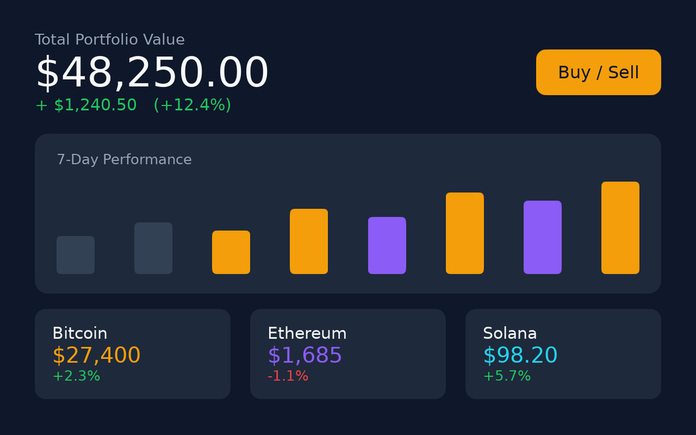
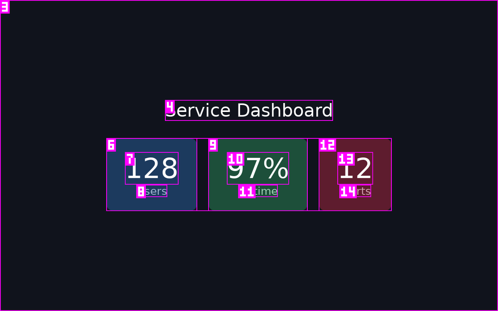

# dali-ui-preview-cli

> **Render Tizen DALi UI C++ to a real PNG screenshot + a structured JSON scene tree — so a coding agent (or you) can *see* the UI and fix it in a loop.**

[English](README.md) | [한국어](README.ko.md)


<p align="center">
  
  <br><sub>Four real renders the CLI produced from small C++ snippets — no device, no emulator. Each one is a reproducible <a href="samples/showcase">sample</a>.</sub>
</p>

## What it does

Write a snippet of DALi (Tizen's Dynamic Animation Library) UI C++, and this CLI renders it headlessly inside a Docker container, then hands you back two things: a real **PNG screenshot** and a deterministic, machine-readable **UI scene tree** (every node's id, type, role, on-screen bounds, source line, and properties). You can then **verify** that render against a target image and/or tree and branch on the exit code. `stdout` is pure JSON, so it drops straight into an agent's parser.

<p align="center">
  
</p>

## Why

LLM coding agents can write UI code, but they can't *see* whether it looks right. `dali-ui-preview-cli` closes that loop: an agent runs **write → render → compare → rewrite**, reading the structured tree first (cheap, exact, diffable) and the image second (for vision). No DALi SDK build is required on your machine — just Docker. The same loop is just as useful for a human eyeballing a layout in a terminal.

## Prerequisites

- **Node.js >= 18** (to run the CLI itself), plus **one runtime** (below).
- **Docker** (the default runtime), usable by your user — the render preflight runs `docker info`. The runtime image **auto-pulls on the first render** (~290 MB; DALi Toolkit + Xvfb for off-screen rendering). The **registry auto-detects**: inside the Samsung network the BART GHCR proxy `ghcr-docker-remote.bart.sec.samsung.net/lwc0917/dali-preview-runtime` (avoids intermittent GHCR pull drops), otherwise `ghcr.io/lwc0917/dali-preview-runtime` — same repo path, so tags/digests match. The pull prints which server it comes from. Override with `--runtime-image`, `DALI_PREVIEW_IMAGE`, or the `image` key in `.dali/config.json` (written by `init`).

> **Shared with the DALi Preview VS Code extension.** In Docker mode this CLI uses the *same* runtime image and the *same* named volumes (`dali-preview-ccache`, `dali-preview-shader-cache`) as the DALi Preview VS Code extension. If you already use the extension, the image and warm build caches are reused — no extra download, faster renders, and updating the image once benefits both.

The container is only needed for the Docker render path. `--version`, `--help`, `--list-versions`, and the pure tree/overlay/diff logic do not require a live daemon.

## Runtimes: Docker (default) or local

You can render two ways. **Docker is the default and needs no setup beyond Docker.** Pick per render, or persist a default with `init`.

| | Docker (default) | Local (native) |
|---|---|---|
| Prerequisite | Docker daemon + runtime image | A built DALi install + `g++`, `pkg-config`, `Xvfb` on the host |
| Select | (default) | `--runtime local` / `--local` |
| Point at DALi | — | `--dali-prefix <path>`, or `DESKTOP_PREFIX` / `DALI_PREVIEW_PREFIX` env |
| Determinism | pinned image, `llvmpipe` software raster | depends on *your* DALi build + host fonts/GPU (may differ) |
| Image mgmt | `--list-versions` / `--pull` | n/a (no image) |
| Failure exit | `12` Docker unavailable | `13` local runtime unavailable |

**Local mode** is for uifw developers who rebuild DALi and want the preview to reflect their fresh `.so` files. Two ways to use it:

```bash
# one-off:
dali-ui-preview-cli app.preview.dali.cpp --runtime local --dali-prefix ~/dali-env/opt --image out.png

# persist the choice once (writes .dali/config.json), then render with no flag:
dali-ui-preview-cli init            # detects Docker AND local, picks one, persists it
dali-ui-preview-cli app.preview.dali.cpp --image out.png
```

Selection precedence (highest first): `--runtime` / `--local` flag → `DALI_PREVIEW_RUNTIME` env → `.dali/config.json` → **docker** default. The DALi prefix resolves by: `--dali-prefix` → `DALI_PREVIEW_PREFIX` → `.dali/config.json` → `DESKTOP_PREFIX` → a `setenv` file → `pkg-config` → common paths.

> **Caveats for local mode.** Renders use *your* host DALi build, fonts, and GPU rather than the pinned image, so output can differ from Docker (e.g. CJK text needs `fonts-noto-cjk` installed, or it renders as boxes). Because of that, `--baseline` visual checks are **runtime-specific** — capture and verify a baseline in the *same* runtime you'll compare against. The scene-tree structure is the same in both runtimes.

## Install

This CLI is distributed **straight from the GitHub repo** — it is intentionally **not
published to npm**. Every command below installs/runs it from `dalihub/dali-ui-preview-cli`,
which `npm`/`npx` clone and build for you (Node 18+ required).

**Install once (recommended)** — puts `dali-ui-preview-cli` on your `PATH`, so the render
loop is fast (no re-clone per render) and nothing temporary piles up:

```bash
npm i -g github:dalihub/dali-ui-preview-cli
dali-ui-preview-cli --version
```

**Or run ad-hoc with npx (no install)** — fine for a one-shot; note npx re-clones and
re-builds on each cold run, so prefer the global install for a render loop:

```bash
npx -y github:dalihub/dali-ui-preview-cli <input.cpp> --image out.png
```

**Or from source:**

```bash
git clone https://github.com/dalihub/dali-ui-preview-cli
cd dali-ui-preview-cli
npm install
npm run build
node out/cli.js <input.cpp>
# optional: expose it on your PATH as `dali-ui-preview-cli`
npm link
```

All examples below use `dali-ui-preview-cli` (the global install); substitute
`npx -y github:dalihub/dali-ui-preview-cli` for a one-shot, or `node out/cli.js` from a
source checkout.

## Use it from an AI coding agent

Goal: while writing DALi UI, an agent **renders what it wrote, looks at it, and fixes it in a
loop** — instead of guessing. You set this up **once per project**.

### One-command setup (recommended)

In your DALi project, run:

```bash
# bootstrap: clones the CLI from GitHub, builds it, and seeds this project
npx -y github:dalihub/dali-ui-preview-cli init
# recommended: also install it once so the render loop doesn't re-clone each time:
#   npm i -g github:dalihub/dali-ui-preview-cli
```

`init` seeds the project so any agent picks it up automatically:
- writes **`AGENTS.md`** — the verify-loop instruction, read by Codex, Cursor, Claude Code, …
- writes **`.claude/skills/dali-preview/SKILL.md`** — Claude Code auto-activates it
- adds **`.dali/`** to the project's `.gitignore` — render PNGs + machine-specific config stay out of git
- **detects both runtimes**, picks one (Docker if available, else a ready local runtime — or force it with `init --docker` / `init --local`), **persists the choice to `.dali/config.json`**, then (Docker only) pulls the image and smoke-renders a sample

From then on, when you (or your agent) write DALi UI in that project, the agent runs the CLI,
**Reads the rendered PNG**, checks the scene tree, and fixes — no further setup. Because the
runtime is persisted, later renders need no `--runtime` flag.

> **Prerequisite:** one runtime. For **Docker** (default) the agent can't install Docker
> itself (that needs `sudo`) but *can* pull the image and render once Docker is present. For
> **local** the host needs a built DALi prefix + `g++`/`Xvfb`/`pkg-config` (`init --local`, or
> set `DESKTOP_PREFIX`). Either way `init` still writes the instruction files even if no runtime
> is ready yet.

### Manual setup (no `init`)

Copy [`templates/agent-verification-loop.md`](templates/agent-verification-loop.md) into your
project's `AGENTS.md` (or `CLAUDE.md`). That's exactly what `init` writes.

### Claude Code: install once for *all* projects (optional)

Instead of per-project `init`, install the skill globally via the plugin:

```
/plugin marketplace add dalihub/dali-ui-preview-cli
/plugin install dali-ui-preview@dali-tools
```

The `dali-preview` skill then activates whenever you work on DALi UI, in any project. No MCP,
no server — the CLI shells out to your **local** Docker.

### Check the environment (preflight)

Before rendering, an agent should ask **"is a runtime ready?"** rather than find out by a
failed render. `doctor` answers that as one JSON line — **no network** (Docker daemon check +
local image-tag lookup + filesystem checks only):

```bash
dali-ui-preview-cli doctor
```
```json
{"schemaVersion":1,"ready":true,"recommended":"docker","configured":null,
 "runtimes":{
   "docker":{"available":true,"imagePulled":true,"image":"ghcr.io/lwc0917/dali-preview-runtime:latest","issues":[]},
   "local":{"available":false,"prefix":null,"issues":["No DALi install found. Pass --dali-prefix <path>, set DESKTOP_PREFIX, or run `init`."]}}}
```

- `ready` — at least one runtime is usable now; render with **`recommended`** (the runtime a
  no-flag render will succeed with: the persisted `configured` choice if usable, else Docker,
  else local).
- Each runtime's **`issues`** are actionable strings to relay verbatim to the human — the fixes
  need `sudo`, so an agent should surface them, not run them.
- `docker.imagePulled:false` (with `available:true`) still renders; the first render pulls the
  ~290 MB image once.
- **Exit `0` when ready, `13` when no runtime is usable** — so a script/agent can gate work with
  `dali-ui-preview-cli doctor && dali-ui-preview-cli app.cpp --image out.png`. The JSON report is
  printed on stdout in **both** cases.

## Quickstart

Render a preview file and print its scene tree:

```bash
dali-ui-preview-cli samples/hello-dali.preview.dali.cpp
```

`stdout` is a single JSON line (pretty-printed and trimmed here):

```json
{
  "id": "0",
  "type": "Layer",
  "role": "panel",
  "name": "RootLayer",
  "mark": 1,
  "bounds": { "x": 0, "y": 0, "w": 1920, "h": 1080 },
  "children": [
    {
      "id": "0/1",
      "type": "FlexLayoutImpl",
      "role": "container",
      "mark": 3,
      "bounds": { "x": 0, "y": 0, "w": 1920, "h": 1080 },
      "sourceLine": 13,
      "flexProps": { "direction": "COLUMN", "alignItems": "CENTER", "justifyContent": "CENTER", "wrap": "NO_WRAP" },
      "children": [
        {
          "id": "0/1/0",
          "type": "LabelImpl",
          "role": "label",
          "text": "Hello, Dali!",
          "mark": 4,
          "bounds": { "x": 829, "y": 502, "w": 262, "h": 56 },
          "sourceLine": 21,
          "children": []
        },
        {
          "id": "0/1/1",
          "type": "LabelImpl",
          "role": "label",
          "text": "Edit this file to see the preview update",
          "mark": 5,
          "bounds": { "x": 787, "y": 558, "w": 346, "h": 20 },
          "sourceLine": 25,
          "children": []
        }
      ]
    }
  ],
  "meta": { "resolution": { "w": 1920, "h": 1080 }, "theme": "dark", "dpr": 1 }
}
```

(The full tree also includes the two internal zero-area `CameraActor` siblings DALi inserts. A label's `name` is empty — its displayed text is in `text`.)

Also write the screenshot:

```bash
dali-ui-preview-cli samples/hello-dali.preview.dali.cpp --image out.png
```

`--image` is optional and orthogonal to stdout: it writes the PNG but does not change the JSON.

## Input modes

The preview code can come from three sources (pass exactly one):

```bash
# 1. A FILE — a *.preview.dali.cpp file, or a regular .cpp/.h with
#    @dali-preview-begin / @dali-preview-end markers delimiting the region.
dali-ui-preview-cli samples/hello-dali.preview.dali.cpp

# 2. STDIN — a `-` positional, or just piped in (no positional).
cat samples/hello-dali.preview.dali.cpp | dali-ui-preview-cli
dali-ui-preview-cli - < samples/hello-dali.preview.dali.cpp

# 3. INLINE — a code block passed on the command line.
dali-ui-preview-cli --code 'return Label::New("Hello, Dali!");'
```

## Features

Each group below is one labelled example: the exact command and what you get back. Most flags compose; the exceptions are noted in `--help`.

### Annotated screenshot (Set-of-Mark) — `--overlay`

Write a "Set-of-Mark" PNG: each node gets a numbered magenta box matching its `mark` in the tree, so an agent (or a person) can refer to a control by number.

```bash
dali-ui-preview-cli samples/hello-dali.preview.dali.cpp --overlay overlay.png
```

You get `overlay.png` with boxes labelled `#1 Layer`, `#3 FlexLayoutImpl`, `#4 "Hello, Dali!"`, `#5` subtitle, etc. The JSON tree is still printed to stdout.

<p align="center">
  
  <br><sub>Every node boxed + numbered so an agent can point at one — "recolor #19", "enlarge #7" — and map it straight to the tree.</sub>
</p>

### Locate a node — `--at` / `--node`

Find the topmost node at a pixel:

```bash
dali-ui-preview-cli samples/hello-dali.preview.dali.cpp --at 500,290
```

```json
{ "id": "0/1/0", "mark": 4, "type": "LabelImpl", "role": "label", "bounds": { "x": 829, "y": 502, "w": 262, "h": 56 } }
```

Or look up a node's region by id:

```bash
dali-ui-preview-cli samples/hello-dali.preview.dali.cpp --node 0/1/0
```

Both print **only** their lookup JSON (the smallest box containing the pixel wins). They are mutually exclusive. A miss prints `{ "at": [x,y], "node": null }` (for `--at`) or `null` (for `--node`).

### Human-readable tree — `--format tree`

```bash
dali-ui-preview-cli samples/hello-dali.preview.dali.cpp --format tree
```

```text
Layer "RootLayer" #1  [0]  (1920x1080 @ 0,0)
┠╴CameraActor "DefaultCamera" #2  [0/0]  (0x0 @ 960,540)
┠╴FlexLayoutImpl "" #3  [0/1]  (1920x1080 @ 0,0)
┃ ┠╴LabelImpl "" #4  [0/1/0]  (262x56 @ 829,502)
┃ ┖╴LabelImpl "" #5  [0/1/1]  (346x20 @ 787,558)
┖╴CameraActor "CaptureDefaultCamera" #6  [0/2]  (0x0 @ 960,540)
```

The box-tree line shows the actor `name` (empty for labels); the displayed text lives in the JSON `text` field. `--format json` is the default.

### Self-contained report — `--report`

Write an HTML or Markdown report (embedded PNG + box-tree + node table). The JSON tree is still printed to stdout; the file extension picks the format.

```bash
dali-ui-preview-cli samples/hello-dali.preview.dali.cpp --report report.html
dali-ui-preview-cli samples/hello-dali.preview.dali.cpp --report report.md
```

### Bound the output for token limits — `--max-depth` / `--max-nodes`

Trim the stdout JSON so it fits an agent's context window (a `truncated` marker shows where pruning stopped):

```bash
dali-ui-preview-cli samples/hello-dali.preview.dali.cpp --max-depth 1
dali-ui-preview-cli samples/hello-dali.preview.dali.cpp --max-nodes 3
```

### The verify loop — `--baseline` / `--baseline-tree` / `--update-baseline`

The agent loop is **write → render → verify → branch on `$?`**.

First, capture a baseline from a known-good render:

```bash
dali-ui-preview-cli good.cpp --update-baseline --baseline golden.png --baseline-tree golden.json
```

Then verify a new render against it. stdout becomes a single verdict; the exit code is **0 on match, 20 on divergence** (other codes still mean a tool failure):

```bash
dali-ui-preview-cli candidate.cpp --baseline golden.png --baseline-tree golden.json
echo "exit: $?"
```

A passing verdict:

```json
{
  "match": true,
  "image": { "dimsMatch": true, "diffPixels": 0, "totalPixels": 614400, "ratio": 0, "pass": true },
  "tree": { "added": [], "removed": [], "changed": [] }
}
```

A divergent one (exit 20) — e.g. a node whose bounds moved:

```json
{
  "match": false,
  "image": { "dimsMatch": true, "diffPixels": 4673, "totalPixels": 614400, "ratio": 0.0076, "pass": false },
  "tree": { "added": [], "removed": [], "changed": [{ "id": "0/1/0", "fields": ["bounds"] }] }
}
```

You can verify either dimension alone (just `--baseline` for the image, just `--baseline-tree` for the tree). `--threshold <ratio>` (default `0.01`) sets how many pixels may differ before the image fails; it requires `--baseline`.

### Render config — `--resolution` / `--theme` / `--dpr`

```bash
dali-ui-preview-cli samples/hello-dali.preview.dali.cpp --resolution 800x480 --theme light --dpr 2
```

- `--resolution WxH` — logical render size (default `1920x1080`, the TV FHD profile).
- `--theme dark|light` — background theme (default `dark`).
- `--dpr N` — device-pixel ratio (default `1`); the actual render is `resolution × dpr` device pixels.

The *effective* logical config is echoed on the root as `root.meta = { resolution, theme, dpr }`.

### Live re-render — `--watch`

Re-render and re-emit on every change to the input file (FILE input only — not stdin or `--code`). One emission per render; Ctrl-C to stop.

```bash
dali-ui-preview-cli samples/hello-dali.preview.dali.cpp --watch
```

### Image assets

`ImageView::New("assets/photo.jpg")` / `SetResourceUrl("…")` with a path **relative to the preview file** (or an absolute path) renders in **both** runtimes — the CLI copies the referenced file into the render (rewriting the URL to the container mount or a host path), so no manual staging is needed. An unresolvable or remote (`http(s)://`) URL renders a bundled **gray broken-image placeholder** at the ImageView's requested size, preserving layout — so a gray box means the path didn't resolve. Image-free previews are unaffected (the harness stays byte-identical).

## Runtime versions (DALi releases)

The render runs against `lwc0917/dali-preview-runtime` — pulled from the **BART GHCR proxy** (`ghcr-docker-remote.bart.sec.samsung.net`) inside the Samsung network, else from **GHCR** (`ghcr.io`); the registry is auto-detected and the pull tells you which one it used. Its tags track **DALi releases**: one `dali_<version>` tag per release (e.g. `dali_2.5.28`) plus a rolling `latest`. **`latest` currently tracks DALi `2.5.28`** (the dali-ui the API notes below assume); `--list-versions` is the authoritative, live source for which versions exist and which one you're on (tags are always read from ghcr.io, so the proxy shows the full list too). The first render pulls a tag automatically; these commands manage which one you have and use. Because the image and caches are **shared with the VS Code extension**, updating the runtime once benefits both tools.

List the available versions (remote registry ∪ your local store) as JSON — does **not** render, exit 0:

```bash
dali-ui-preview-cli --list-versions
```

```json
{
  "image": "ghcr.io/lwc0917/dali-preview-runtime",
  "current": "latest",
  "versions": [
    { "tag": "latest", "local": true, "current": true },
    { "tag": "dali_2.5.26", "local": true, "current": false },
    { "tag": "dali_2.5.24", "local": false, "current": false }
  ]
}
```

Pull a tag ahead of time (default `latest`); docker's progress streams to stderr, then a `{"pulled":"<ref>","ok":true}` line to stdout:

```bash
dali-ui-preview-cli --pull                  # pulls :latest
dali-ui-preview-cli --pull dali_2.5.26      # pulls a specific DALi release
```

**Updating the runtime.** Once a tag is on disk it is **cached** — a render reuses the local image and does **not** re-fetch it (fast, and reproducible). So when a newer runtime is published (a moved `latest`, or a new `dali_*` release), it is **not** picked up automatically — pull it explicitly to upgrade, and both this CLI and the VS Code extension then use the refreshed image:

```bash
dali-ui-preview-cli --pull                  # refresh :latest to the newest published runtime
```

Render against a specific DALi version for *this* render with `--image-tag` (e.g. to reproduce against an older release):

```bash
dali-ui-preview-cli samples/hello-dali.preview.dali.cpp --image-tag dali_2.5.24
```

Advanced: `--runtime-image <name>` overrides the image name itself (e.g. a private mirror). `--list-versions` / `--pull` take no input and cannot be combined with render or verify flags.

## JSON node schema

Every node in the tree has this shape (some fields are best-effort and may be absent):

| Field | Type | Meaning |
|---|---|---|
| `id` | string | Stable structural path (child-index), e.g. `"0/1/0"`. |
| `mark` | number | 1-based ordinal; the number drawn on `--overlay`. |
| `type` | string | Concrete DALi type, e.g. `"LabelImpl"`, `"FlexLayoutImpl"`, `"Layer"`. |
| `role` | string | Semantic role, e.g. `"label"`, `"container"`, `"panel"`. |
| `name` | string | Actor name (often empty; the root is `"RootLayer"`). A label's displayed text is in `text`, not here. |
| `text` | string | The displayed text of a text control (Label / InputField). Present only when the control has non-empty text. |
| `bounds` | `{x,y,w,h}` | On-screen box in image pixels (from `CalculateCurrentScreenExtents`). |
| `sourceLine` | number | 1-based line in your source the node maps to (when resolvable). |
| `semanticsSource` | string | `"bridge"` or `"reconstructed"` — where the semantics came from. |
| `visible` | boolean | The actor's `VISIBLE` property. |
| `opacity` | number | The actor's `OPACITY` (0..1). |
| `properties` | object | Exported DALi properties for the node (e.g. `{ "textColor": [r,g,b,a] }`). |
| `flexProps` | object | Present on flex containers: the resolved flex layout, e.g. `{ "direction": "COLUMN", "alignItems": "CENTER", "justifyContent": "CENTER", "wrap": "NO_WRAP" }`. |
| `children` | node[] | Child nodes, in child-index order. |

The **root** node additionally carries `meta`:

```json
"meta": { "resolution": { "w": 1920, "h": 1080 }, "theme": "dark", "dpr": 1 }
```

Note: DALi inserts internal `CameraActor` siblings (zero-area boxes); `--at`/`--node` ignore degenerate boxes, so cameras never match a pixel query.

## Exit codes

| Code | Meaning |
|---|---|
| `0` | Success (also: a verify verdict that matched). |
| `1` | Usage error, or empty input. |
| `10` | Compile error in your code. |
| `11` | Render / capture error. |
| `12` | Docker unavailable (the `docker info` preflight failed). |
| `13` | No usable runtime — from a render: `--runtime local` was selected but a DALi prefix / `g++` / `Xvfb` / `pkg-config` is missing; from `doctor`: neither runtime is ready. |
| `20` | Verify diff mismatch (rendered, but diverged from the baseline). |

`doctor` exits `0` when a runtime is ready and `13` when none is (its JSON report prints on stdout either way).

On a compile/render failure, a structured `{ "phase", "message", "sourceLine" }` JSON is printed to **stderr** (stdout stays empty), e.g.:

```json
{ "phase": "compile", "message": "'Banana' has not been declared", "sourceLine": 13 }
```

## For AI agents

- **stdout is the machine contract.** A bare render prints the full tree JSON; `--format tree` prints a box-tree; `--at`/`--node` print one lookup object; verify mode prints one verdict object; `--list-versions`/`--pull` print one management object; `doctor` prints one readiness report. Exactly one emission per invocation.
- **Preflight before rendering.** Run `doctor` first to learn whether a runtime is ready and which one a bare render will use — instead of discovering it by an exit-12/13 render failure. `ready:false` → relay its `issues` to the human and stop retrying.
- **stderr is for diagnostics**, including the structured compile/render error `{phase, message, sourceLine}`. Parse stdout, watch the exit code, read stderr only on failure.
- **Deterministic.** The same input renders byte-identical JSON, so tree diffs are meaningful and a `--baseline-tree` comparison is exact.
- **Token caps.** Use `--max-depth` / `--max-nodes` to keep the tree within a context window.
- **Branchable exit codes.** Distinguish "tool failed" (1/10/11/12/13) from "rendered but differs" (20) without parsing any text — ideal for the write→render→verify loop; `doctor && render` gates on a ready environment.
- **Future option:** wrap the CLI as an MCP server (a process that exposes tools to Claude/Cursor) so an agent can call `render_preview(code)` directly instead of shelling out.

## License

Apache-2.0.
