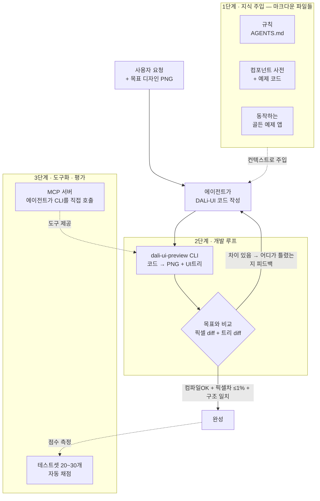

# DALi-UI 에이전트 개발 인에이블먼트 — 한 장 요약

> AI가 DALi-UI 앱 코드를 짜고 → 화면을 직접 렌더해 목표와 비교하고 → 틀리면 고쳐서 다시 짜는 과정을 자동 반복하게 만든다.
> 새 프레임워크라 AI가 없는 API를 지어내는 문제(**환각**)를 — ① 예제로 *줄이고* ② 렌더-비교 루프로 *잡고* ③ 도구로 *배포·측정* 한다.

## 1단계 — 지식 주입: 무엇을, 어떤 형식으로

형식은 **마크다운 텍스트 파일 몇 개** (모델 재학습·파인튜닝 없음). 세 종류를 넣는다:

- **규칙 (`AGENTS.md`)** — "문자열은 작은따옴표", "이 옛 API는 쓰지 마라" 같은 *항상 지킬 짧은 규칙*. 에이전트가 매 작업마다 자동으로 읽는다.
- **컴포넌트 사전 + 예제 (Skill 폴더)** — DALi-UI에 어떤 위젯이 있고(버튼·리스트·Flex 레이아웃) 각각 어떻게 쓰는지를 **실제 컴파일되는 짧은 코드 조각**으로. 관련 작업일 때만 펼쳐 읽어 토큰을 아낀다.
- **골든 예제 앱 5~10개** — 통째로 동작하는 작은 앱. 에이전트가 베껴 변형할 관용 패턴.

→ 핵심: **산문 설명보다 "동작하는 예제 코드"가 환각을 가장 많이 줄인다.**

## 2단계 — 개발 루프: 어떤 도구로 · 어떻게 평가 · 어떻게 재요청 · 언제 통과

1. **도구** — 에이전트가 짠 코드를 `dali-ui-preview` CLI에 넣으면 → **렌더된 PNG** + **UI 구조 트리(JSON: 어떤 위젯이·어디에·무슨 텍스트로 있는지)** 두 개를 출력.
2. **평가 (목표와 비교)** — ① 이미지: **pixelmatch**(두 이미지를 픽셀 단위로 비교하는 라이브러리)로 목표 디자인 PNG와 대조 → "다른 픽셀 몇 %". ② 구조: 트리 JSON을 기대 구조와 대조 → 빠진 위젯·틀린 텍스트·어긋난 좌표 검출.
3. **재요청** — 비교 결과를 그대로 프롬프트로 되먹임: *"제목 텍스트 누락, 버튼이 목표보다 20px 왼쪽"* 같은 **구체 피드백** → 에이전트가 그 부분만 고쳐 1번으로 되돌아감.
4. **통과 기준** — 컴파일 성공 **AND** 픽셀 차이 임계값 이하(예: ≤1%) **AND** 트리 구조 일치 → 루프 종료.

쓰는 기술: 헤드리스 렌더(Xvfb, 화면 없이 그리기) · pixelmatch · JSON diff · 안정 ID(이미지의 위젯과 트리의 노드를 같은 번호로 묶어 "3번 버튼"처럼 정확히 지칭).

> 런타임은 두 가지 — **Docker(기본, 재현성)** 또는 **로컬 네이티브**(호스트의 DALi 빌드 + `g++`/`Xvfb`/`pkg-config`, `--runtime local`). `init`이 둘을 감지해 하나를 골라 `.dali/config.json`에 저장하므로 이후 렌더는 플래그가 필요 없다. DALi를 직접 빌드하는 개발자는 로컬 모드로 방금 만든 `.so`를 바로 프리뷰에 반영할 수 있다.

## 3단계 — 도구화 · 평가

- **도구화** — 위 CLI를 **MCP 서버**(에이전트가 외부 도구를 표준 명령으로 호출하는 규약)로 감싼다 → Claude·Cursor가 사람 손 없이 `render_preview(코드)` 한 줄로 직접 호출.
- **평가 (전체 품질 측정)** — "로그인 화면 만들어" 같은 **과제 20~30개 묶음(테스트셋)** 을 에이전트에 자동으로 풀린 뒤 채점(컴파일 성공률 · 평균 픽셀 일치율) → 1단계 지식을 고칠 때마다 점수가 오르는지 확인.

## 전체 흐름

_선행 사례: axe(iOS, 코드→PNG+뷰트리, Claude 플러그인) · Playwright MCP(접근성 트리+안정 ID) — 같은 방식이 이미 검증됨. DALi엔 아직 없는 빈 자리._
